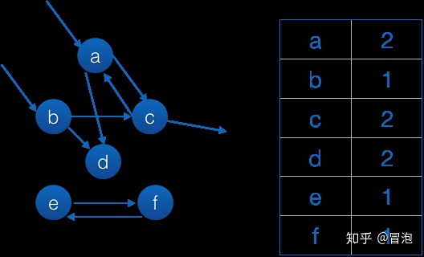
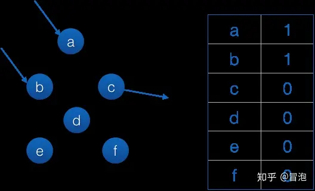
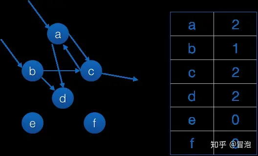

1、小整数对象池
默认范围：[-5, 256]
解释器之前就已经创立好

2、大整数对象池

3、intern机制
默认自动对普通字符串开启 intern机制，但是如果字符串中包含 空格 等特殊字符，就不会开启。
减少字符串的重复存储，从而节省内存空间。
在 Python 中，每当你创建一个新的字符串时，解释器会检查该字符串是否已经存在于字符串池（string pool）中。
如果是的话，它会返回已经存在的字符串的引用，而不是创建一个新的字符串对象。这个过程被称为 "字符串驻留"。

垃圾回收机制：
    1、引用计数器：每个对象中有一个小空间，用于存储“引用计数”
        优点是：实时性。
        缺点是：
          ·维护引用技术消耗资源
          ·循环引用。无解
            a = fun1()
            b = fun2()
            a.val = b
            b.val = a
            del a
            del b
    2、局部标记清除
        ① 取一个对象集和，记录每个对象的引用情况，可能存在“某对象引用集和外部对象、某对象被集和外部对象引用”的情况。
        比如下图的a、b对象引用了外部对象，c对象被外部对象引用。
        
        ② 去除所有内部引用
        
        ③ 由根节点a、b开始恢复引用，最后refcnt仍然为0的即为垃圾对象
        
    3、分代回收
        这是在“局部标记清除”的基础上进行的，分为三个集和，分别表示未被回收的程度。
        这三个集和的回收频率依次下降。
对于gc阈值的补充：
    set_threshold()中的三个参数threshold0, threshold1, threshold2。
    gc会记录自从上次收集以来新分配的对象数量与释放的对象数量，当两者之差超过threshold0的值时，gc的扫描就会启动，初始的时候只有世代0被检查。
    如果自从世代1最近一次被检查以来，世代0被检查超过threshold1次，那么对世代1的检查将被触发。
    相同的，如果自从世代2最近一次被检查以来，世代1被检查超过threshold2次，那么对世代2的检查将被触发。
    get_threshold()是获取三者的值，默认值为(700,10,10).